## [**DAO Workshop 🔧 (Testnet)**](https://medium.com/@joselfgaray/dao-workshop-testnet-b406380894a6) by [joselfgaray](https://twitter.com/joselfgaray)
> Original article: [https://medium.com/@joselfgaray/dao-workshop-testnet-b406380894a6](https://medium.com/@joselfgaray/dao-workshop-testnet-b406380894a6)

**3 simple steps + screenshots to build your decentralized organization on top of Aragon!**

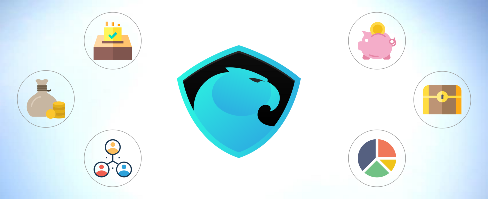

Hey there fellow creators! This post aims to be a resource for anyone who wants to set up any kind of organization using Aragon’s technology, [which released its beta just a few days ago](https://blog.aragon.one/aragon-core-v0-5-the-architect-release-327c7163b89c). It’s supposed to function as a workshop in which creators find the initial guidance necessary to start experimenting with the possibilities of DAOs, the new kind of digital organizations!

The style of the guidelines that follow is very basic: someone with pretty much no knowledge of cryptocurrencies or Ethereum should get a solid understanding of the mechanics on how to create a DAO on top of Aragon following 3 simple steps.

> _Aragon’s beta version is now live on the Rinkeby Testnet, and here we’ll talk about that version (Aragon 0.5 — The Architect). For future deploys, we’ll make additional posts._

### The Basics
#### What is a DAO?
DAO stands for Decentralized Autonomous Organization. It is an organization built on top of the Ethereum blockchain, a set of smart contracts that allow for organizations to operate following new governance models that will make even Silicon Valley startups seem _traditional_. I wrote more deeply about Decentralized Autonomous Organizations' nature [here](https://medium.com/@joselfgaray/nature-the-ugly-daockling-2-7b3371b55fcd).

#### Benefits of a DAO
- Can’t be censored
- Programmable governance modules for different organization models
- [Tokens](https://blockgeeks.com/guides/ethereum-token/) easily and transparently distributed
- Operates under a [digital jurisdiction](https://blog.aragon.one/introducing-the-aragon-network-20b998e2caba) in our current digital era
- No central power can be corrupted
- Easier to attract talent around the globe to contribute to the organization’s mission
- Various entities: people, other orgs, software…
- Transparent transactions
- _... many more!_

#### What does Aragon do?
Aragon does many useful things! First and foremost, Aragon [provides simple software for the setup of any organization](https://blog.aragon.one/aragon-core-v0-5-the-architect-release-327c7163b89c). Within a few clicks and very little cost, you can start running a digital organization. Sounds good huh? It also provides a digital jurisdiction for governance and dispute resolution: [the Aragon Network](https://blog.aragon.one/introducing-the-aragon-network-20b998e2caba).

To understand Aragon’s mission in the crypto & DAO space, you can check a little post I made about it, or watch an awesome video released by the team!

[**The Aragon Mission**](https://medium.com/@joselfgaray/the-aragon-mission-6cf972884769)
> [Empowering unstoppable organizations through freedom of collaboration](https://medium.com/@joselfgaray/the-aragon-mission-6cf972884769)
 

### Getting Started
So, you’ve decided you’re creating an organization in 21st century fashion? Awesome! Let’s dive into the **3 simple steps** you have to follow to get started using the software that will facilitate the organization’s operations from now on.

#### 🍼 Step 1: basic Ethereum tools
We’ll take for granted you know a little bit about what a blockchain is and what Ethereum does (if not, there’s plenty of information online for you to dive into). Yet, some tools and terms might seem confusing, so we’ll outline some very easy to follow definitions about key tools that you must know to set up a DAO.

**Ether**: Ethereum’s currency/token. The fees to set up the organization, vote, etc. will be paid in ether.

**(Rinkeby) Testnet**: Ethereum network built for testing purposes where the ether transacted is virtual; _doesn’t hold real value_. Aragon 0.5 — The Architect is deployed on this testnet. To get faucet funds for the Rinkeby Testnet, [follow this link](https://faucet.rinkeby.io/).

**MetaMask** is a browser extension that allows you to interact with Ethereum Dapps (like Aragon) directly from Chrome, Firefox or Brave. More info and installation help can be found [here](https://metamask.io/).

[**Etherscan**](https://etherscan.io/) allows you to explore and search the Ethereum blockchain for transactions, addresses, tokens, prices and other activities taking place on Ethereum. Aragon 0.5 will point us to Etherscan when we want to check transaction history of the apps, and some other activities we’ll see now.

#### 🐣 Step 2: create the DAO
Ready to create your DAO? Visit [aragon.one](https://aragon.one/) and click on the blue button on the top right corner that says “Try Aragon Core 0.5”. That will open up a very intuitive initial menu where you must provide the basic infrastructure of your organization.

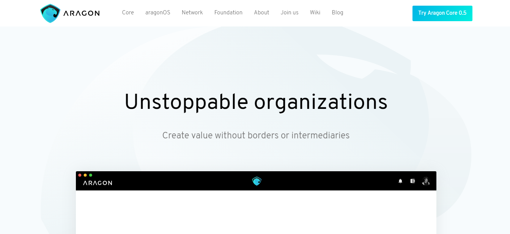

First, you will have to choose between using Democracy or Multisig for your Token project. Multisig is still very early in the making and has pretty much no utility at the moment, so we’ll move forward with Democracy.

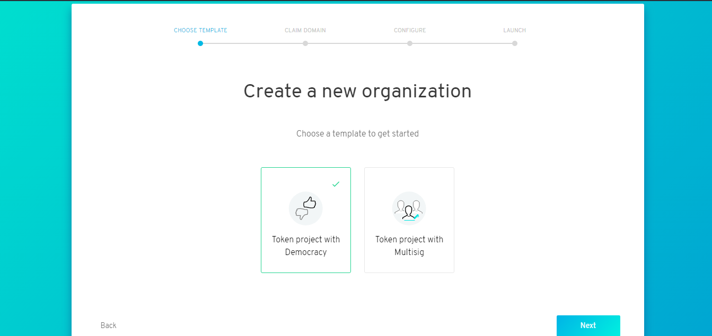

Second, you must claim a domain name in _____._aragonid.eth_ fashion. We chose workshop.aragonid.eth, as shown below, and clicked Next.

Third, we must choose 3 metrics for our Democracy project. They are Support (%), Minimum Quorum (%) and Vote Duration (time). Support is the % of votes an outcome must get to be a winning outcome (in this case, we chose a simple 50% majority). Min.Quorum is the minimum % of token holders that must participate for the vote to be accepted, for which we chose 23% as an example (Min.Quorum can be a bit confusing specially for small organizations: we’ll take a deeper look later when working with the Voting app). Vote Duration represents the time a vote is open; we chose 72 hours.

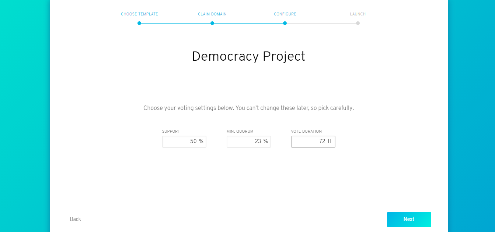

Next, we have to choose the name and symbol for our DAO’s token. We wrote AWK as the ticker.

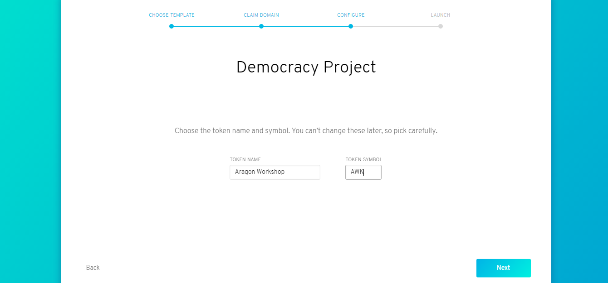

Finally, we must sign two transactions (Token Creation and Organization Creation) with our MetaMask wallet. Testnet price to set up the DAO was ~$50 at the time of the experiment, which depends mostly on the Ethereum Network fees. Remember, it’s virtual ether for now!

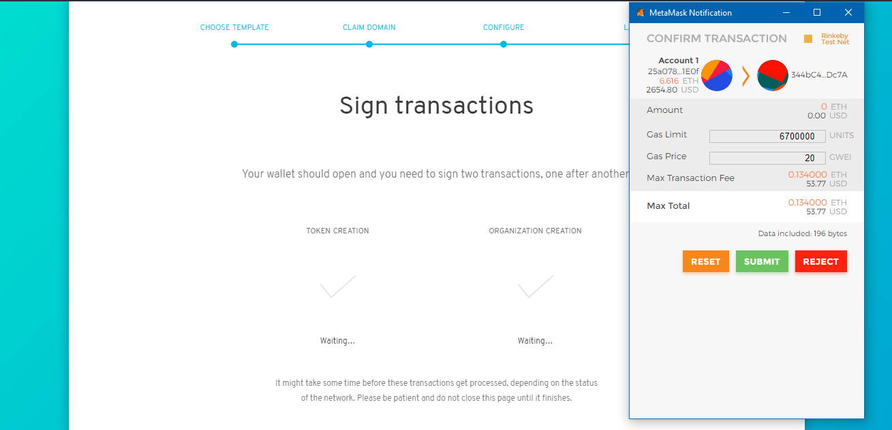

Clicking twice on Submit (green button) should finish the process, and you should get a message like the one below. Congratulations! Your DAO is ready. Let’s click on Get Started!

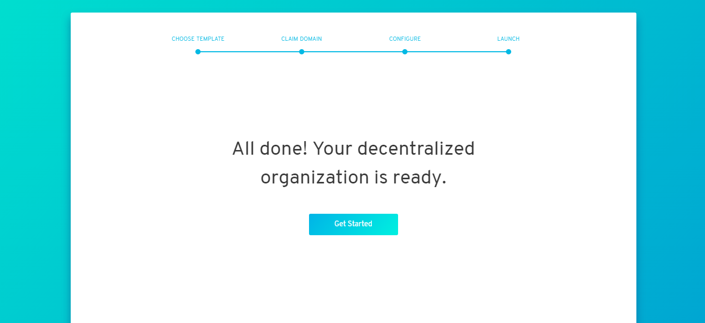

When we click on the blue Get Started button, we are entering our Aragon DAO for the first time. Exciting! The homepage should present us with four functions regarding the 3 apps available. We’ll now take a deeper look into each one of those.

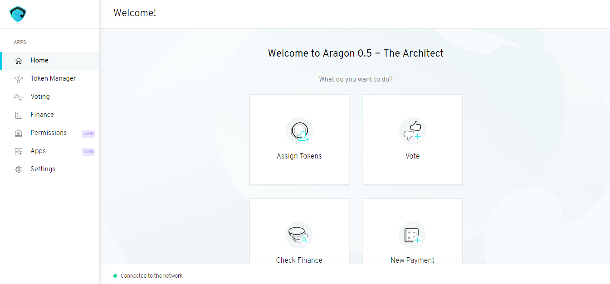

P.S. This is the creation process for a DAO on Aragon. To enter the DAO afterwards, we must simply open it after clicking “Try Aragon Core 0.5” on [aragon.one](http://aragon.one/) by entering its name and clicking on “Open organization”, as shown below.

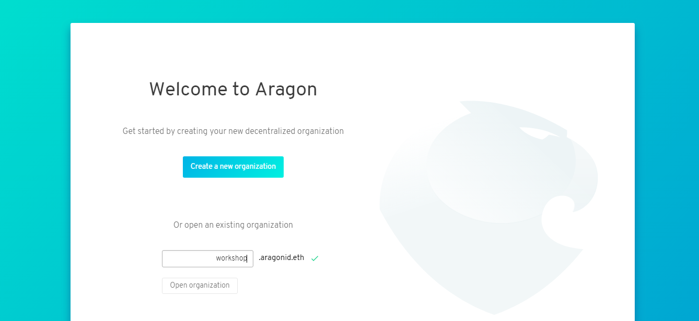

#### 📎 Step 3: use the apps you need
Now that we’ve set up our DAO, we can use the three apps available (for now). They are Token Manager, Voting and Finance, and we’ll also look at the DAO’s settings. They all can be accessed by clicking on the menu at the left of the screen.

##### 📊 Token Manager
The Token Manager lets you distribute your organization’s tokens amongst stakeholders. At first, the MetaMask wallet address you used for the creation of the DAO will own 100% of the tokens.

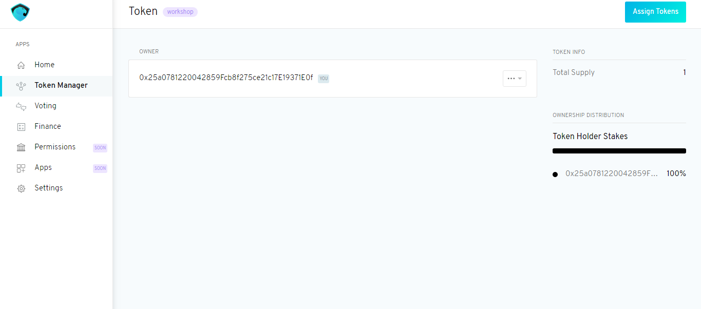

To assing tokens to other DAO members, click on the blue button at the top right corner that says “Assing Tokens”. There, you must provide a valid Ethereum Address for the Recipient of the tokens, and the number of tokens you want to mint. We have chosen to mint 0.1 tokens for the address below.

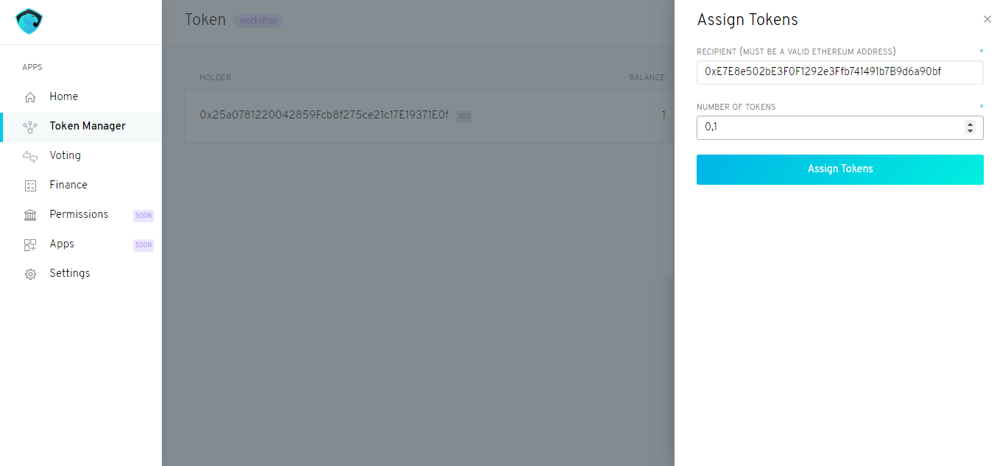

This action will inherently open a vote about the decision to mint the tokens, with your vote in favor. Since you’ll be the only token holder at the moment, the vote will automatically close with a Yes. You’ll have to sign the transaction using MetaMask.

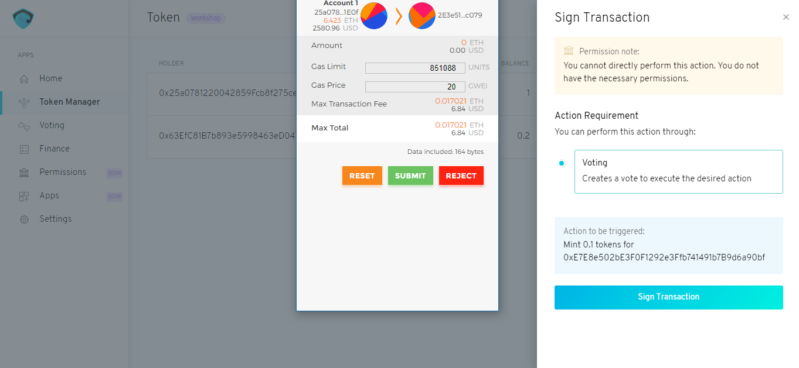

After assigning tokens to a couple of addresses, your Token Manager should look somewhat like this (check total token distribution at the right of the screen):

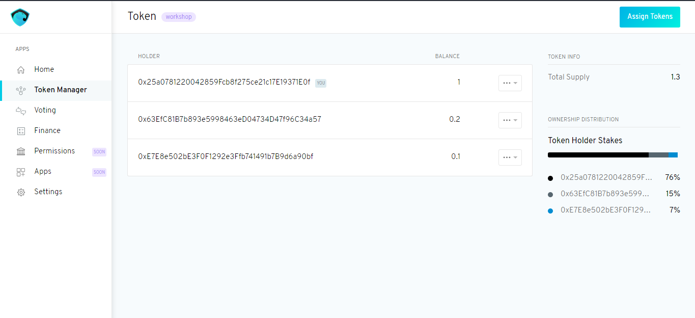

For a more technical description of the Token Manager, see [here](../../dev/apps/token-manager.md).

##### ✋ Voting
The Voting app is an entity that will execute a set of actions on other entities if token holders of the DAO decide to do so. To open up a new vote, click on the top right corner “New Vote” button. Then, we must simply state what the vote is for, and click on Begin Vote. You’ll have to confirm the transaction through MetaMask (it’ll open itself automatically).

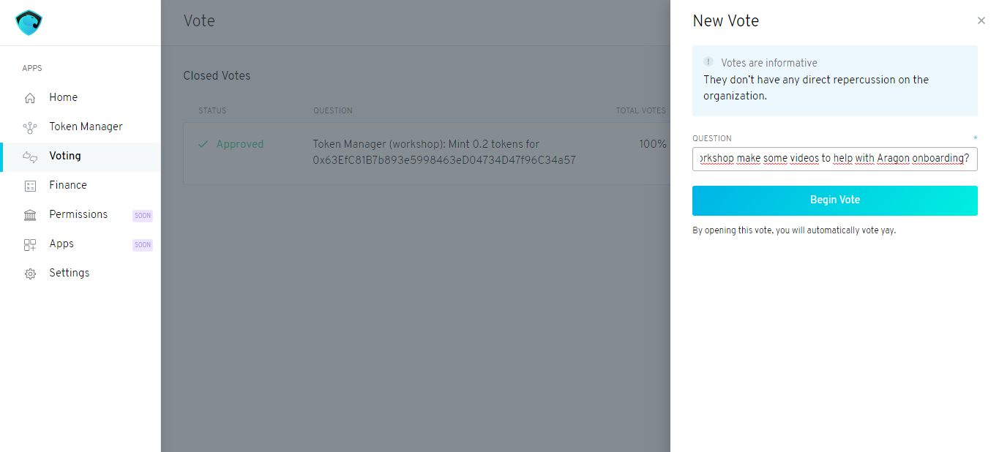

To see the details of a certain vote, you can click on View Vote at the right of the screen. It should open up a dashboard like the one below. Remember that you have to be a token holder to be able to participate in a vote in a certain DAO.

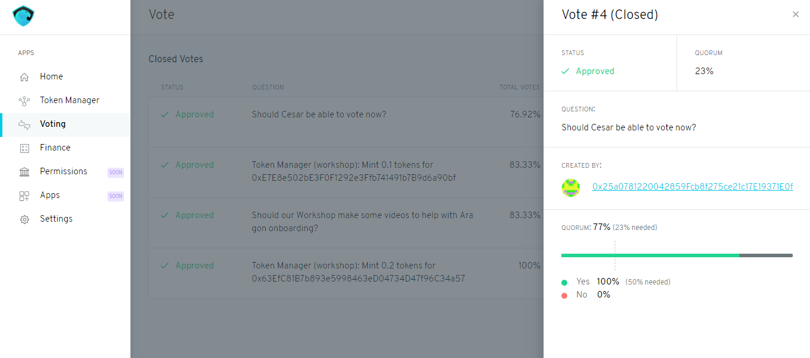

There, we have the Status of the vote, the Quorum (this is set when setting up the DAO), the Question, its creator, and the current results.

In the Workshop’s case, I am holder of 76% of the DAO’s tokens, so as soon as I voted on something (you automatically vote Yes when creating a vote) the vote was closed (as seen in the screenshot). This was confusing at first, but makes sense mathematically; Quorum and Support were met as soon as I voted! I would recommend to keep this in mind when allocating tokens for testing purposes with your fellow creators or partners, otherwise you won’t be able to really try out Voting.

For a more technical description of the Voting app, see [here](../../dev/apps/voting.md).

##### 💰 Finance
The purpose of the Finance app is keeping track of income and expenses in your organization, as well as performing payments. At first, your finances will look somewhat empty, as the DAO holds no funds of her own yet.

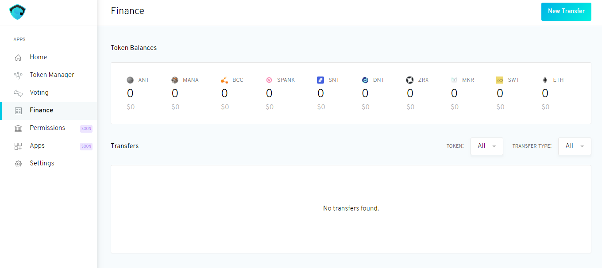

You can use your MetaMask wallet to send some funds to the DAO, or use some other Rinkeby options available for fund transfer. The address to use will be specified later, in the Settings section. In our case, we sent 0.9 to the DAO, which show up in the panel after the transaction takes place in the Ethereum network (you must wait a bit).

Now that the DAO owns funds, you can perform payments by clicking on the “New Transfer” button on the top right corner. Then, you must choose the Recipient’s address, the amount of tokens and the token (ETH, ANT…) in which you want to send the payment, and add a Reference (short phrase) to identify it. It will be sent by clicking on Submit Transfer.

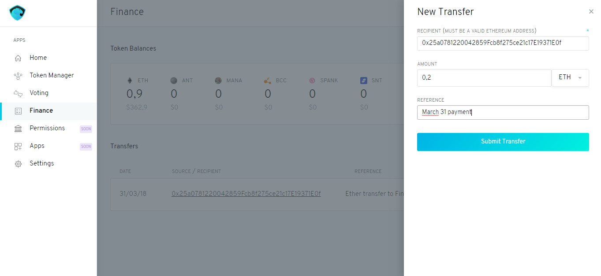

For a more technical description of the Finance app, see [here](../../dev/apps/finance.md).

##### 🔩 Settings
You can find the Organization’s and the Apps’ addresses in the Settings tab. You should not send funds to the DAO by transacting with the Organization’s address! I made this mistake and wasted a bit of my time, I guess.

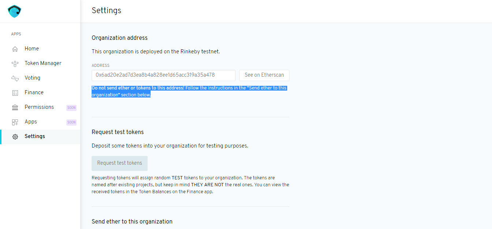

Good warning
Aragon 0.5 — The Architect operates on Rinkeby’s Testnet, so you can request test tokens by clicking that option on your DAO’s settings, as seen above, and that will send some test tokens for the DAO to play with. You can also send tokens directly to the Finance app of the DAO, which has its own address. Either way, the funds will appear on the Finance tab shortly after.

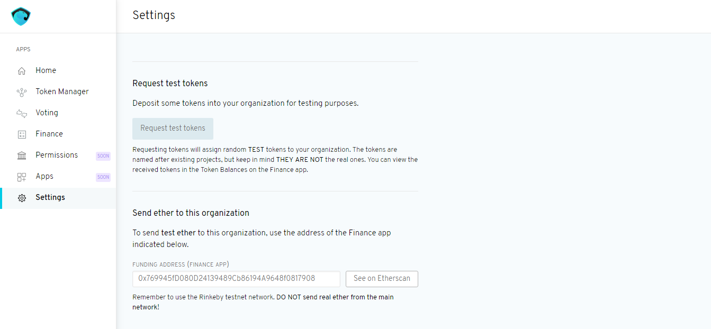

The Token Manager and the Voting app of your DAO also have their own addresses, and their updates can be checked on Etherscan. Below are the recorded transactions of our Workshop’s Voting app.

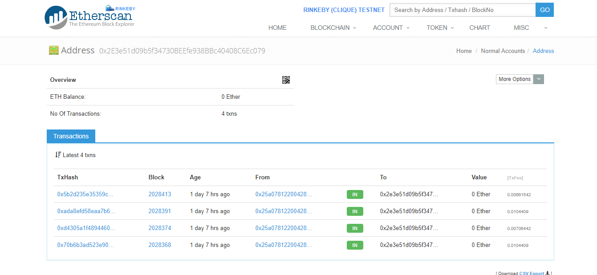

To check out more info about the current and future Aragon apps, [visit the wiki](../../index.md).

#### 💙 Bonus Step: enjoy the journey!
These are the basic things you need to know to set up and operate a DAO with Aragon’s current software. Now it’s time to have fun! The team is always active in the [community chat](https://aragon.chat/), so for any further doubts it’s a good idea to reach @light or @tatu there; they’ll quickly help you solve your problems. Some questions were recurring in the chat and social media, so I thought I’d contribute with an explanatory post summarizing the 3 initial steps for anyone to create a Decentralized Autonomous Organization.

Thanks a lot for reading! You may comment below what’s the purpose of your DAO or [tell me on Twitter @ joselfgaray](https://twitter.com/joselfgaray) 💡

_**Disclaimer**_: _Published in the wiki with the permission of [joselfgaray](https://twitter.com/joselfgaray)_
